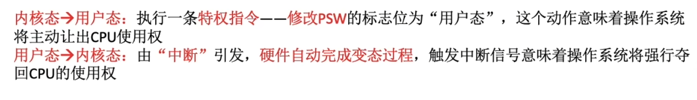
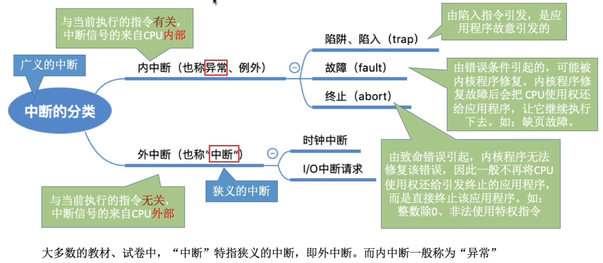

# 运行环境（运行模式）

> **本节要点**
> - **两种指令**：特权指令 vs 非特权指令
> - **两种处理器状态**：核心态（管态/root） vs 用户态（目态）
> - **两种程序**：内核程序（kernel） vs 应用程序
> - **中断机制**是实现**并发的前提**（时钟中断实现进程交替运行）

## 一、两种指令

> **概念**：CPU 执行指令时，根据是否涉及系统全局资源，将指令划分为特权指令与非特权指令。

| 指令类型 | 执行权限 | 能否影响系统全局 | 典型示例 |
| --- | --- | --- | --- |
| **特权指令** | 仅**核心态**可执行 | 是 | 清内存、置时钟、中断屏蔽、I/O 操作、修改 PSW |
| **非特权指令** | 用户态 / 核心态均可执行 | 否 | 算术逻辑运算、取数、存数、转移指令 |

## 二、两种处理器状态（CPU 状态）

| 状态 | 别名 | 可执行指令 | 运行的程序 |
| --- | --- | --- | --- |
| **核心态**（Kernel Mode） | 管态、系统态、root、supervisor | 特权指令 + 非特权指令 | 内核程序 |
| **用户态**（User Mode） | 目态 | 仅非特权指令 | 应用程序 |

> **状态如何表示？** 处理器当前处于何种状态，由**程序状态字 PSW** 中的某个标志位记录。CPU 每次执行指令前都会检查该标志位，**特权指令若在用户态下执行，将被视为非法**。

### 状态的切换

> **记忆：** 出去靠"改 PSW"（软件主动），进来靠"中断"（硬件强制）。

## 三、两种程序

- **内核程序（kernel）**：运行在**核心态**，实现**资源管理**与**基础服务**（进程管理、内存管理、文件管理、设备管理等）。
- **应用程序**：运行在**用户态**，为用户解决具体业务问题，**不能直接操作硬件**。（注意陷入指令（trap）是非特权指令）

> **三者一一对应**
> 内核程序 → 核心态 → 特权指令
> 应用程序 → 用户态 → 非特权指令
>
> 即"**谁在跑 → 处于什么态 → 能执行什么指令**"层层决定。

## 四、中断机制

> **核心考点：** **中断机制是实现并发的前提**。在多道程序环境下，系统通过**时钟中断**强制夺回 CPU，再调度另一个进程运行，从而实现进程之间的**交替执行**（宏观并行、微观串行）。
> - 没有中断 → 程序只能一跑到底 → 谈不上并发。
> - 有时钟中断 → OS 定期夺回 CPU → 进程可被切换 → 才能并发。

### 中断的分类

> **术语约定：** 大多数教材中，"**中断**"特指**狭义的中断**（即外中断），而内中断一般称为"**异常**"。"中断"保留给来自 CPU 外部、异步的事件。

> **原语:** 原语是一种特殊程序具有原子性，程序的运行必须一气呵成，**无法中断**
# 系统调用

> **概念：** 应用程序通过**系统调用**请求操作系统提供的服务，从而保证系统的**稳定性与安全性**。它是应用程序进入核心态、使用特权资源的唯一「官方通道」——应用程序无法直接操作硬件，必须经由它陷入内核。

## 系统调用 vs 库函数

- **系统调用是操作系统向上层提供的接口**：位于应用程序与内核之间，是受控的底层「特权接口」。
- **有的库函数是对系统调用的进一步封装**：库函数不直接操作内核，而是帮我们更方便地发起系统调用。
- **当今编写的应用程序，大多通过高级语言提供的库函数，间接地进行系统调用**：例如 C 语言的 `printf` 背后调用了 `write` 系统调用。

> **记忆：** 库函数是「封装层」，系统调用是「内核接口」；用户程序大多走库函数，库函数再走系统调用。

