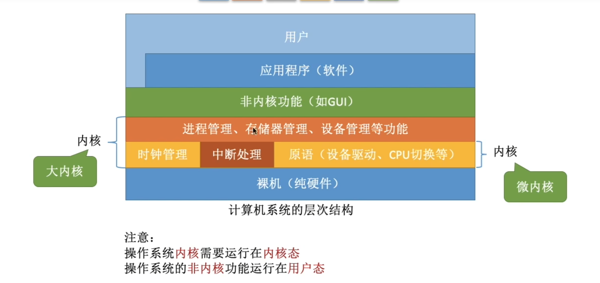
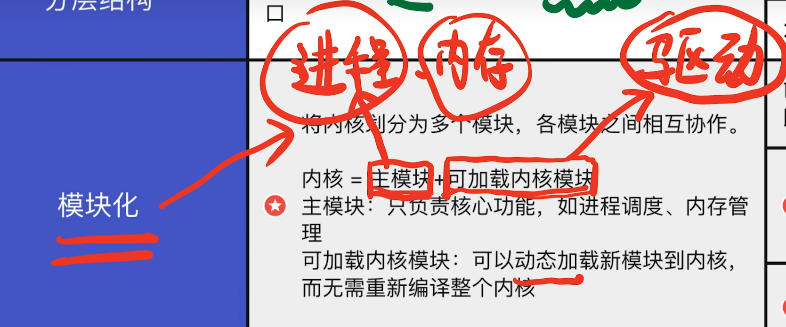
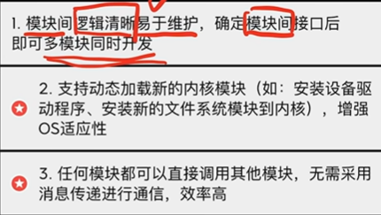
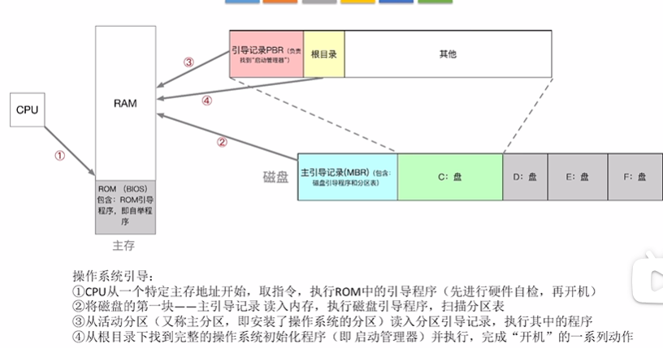

# 体系结构

|      |              大内核              |             微内核             |
| :--: | :------------------------------: | :----------------------------: |
| 优点 |              高性能              | 内核代码少，结构清晰，易于维护 |
| 缺点 | 内核代码庞大，结构混乱，难以维护 |      需要频繁切换，性能低      |

## 分层结构

> 内核分多层，每层可单向调用更低一层的接口
>
> - 优点：便于调试和验证，自底向上，易扩展，易维护
> - 缺点：效率低，不可跨层调用，系统调用执行时间长

## 模块化

- 优点

- 缺点：接口间模块定义不一定合理，模块间相互依赖更难调试和调用

## 外核

> 内核负责进程调度、进程通信等功能，外核负责为用户进程分配未经抽象的硬件资源，且由外核负责保护资源使用安全
>
> - 优点：外核可直接给用户进程分配不虚拟，不抽象的硬件资源，使用户进程可以更灵活的使用硬件资源，减少了虚拟硬件资源“映射层”，提高了效率
> - 缺点：减低了系统的一致性，使系统更加复杂

## 操作系统引导

