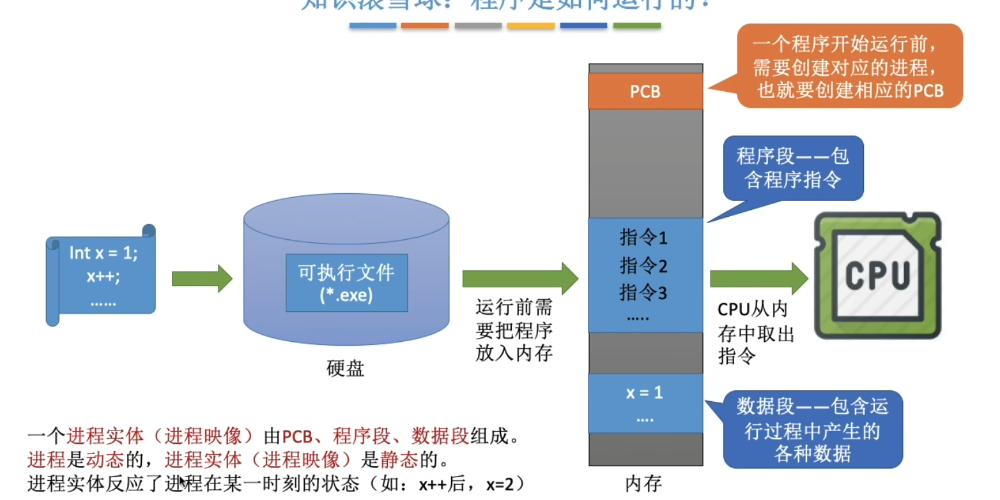

# 进程的概念

> 进程：动态，每个进程有**唯一的不重复的**PID

> PCB： 进程控制块

## 特征

- 动态性
- 并发性
- 独立性
- 异步性
- 结构性

## 状态与转换

> 当进程被创建的时候处于创建态，创建完成后进入就绪态
>
> 当进程请求等待某个事件的发生时，处于阻塞态，等待结束后再次进入就绪态
>
> 进程可以执行exit系统调用，请求系统终止进程，进程进入终止态，进程会下CPU，回收PCB和内存空间资源，最终消失

> PCB 中有state记录状态

### 进程的组织方式

- 链接方式
- 索引方式

