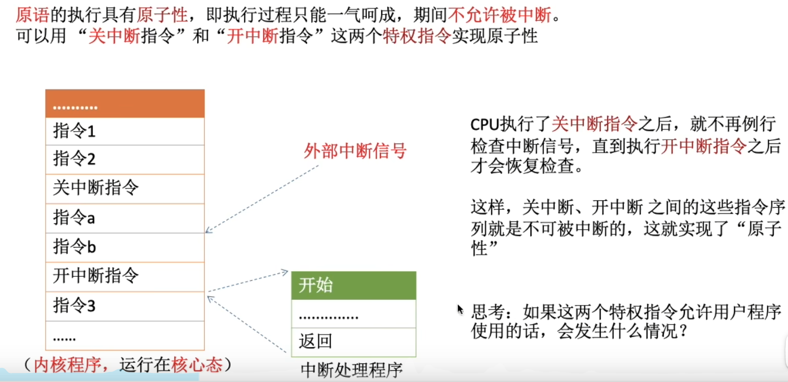
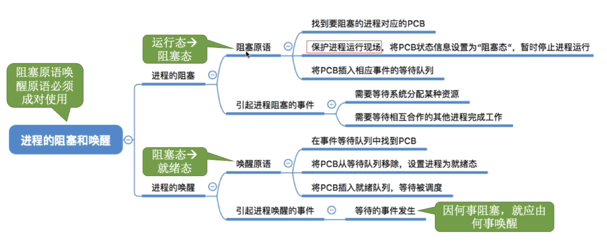
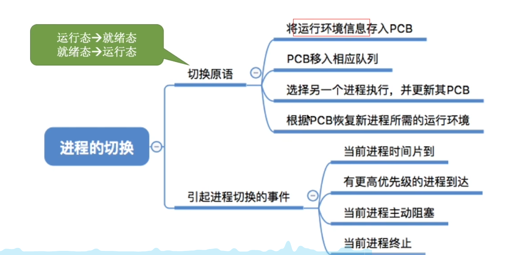
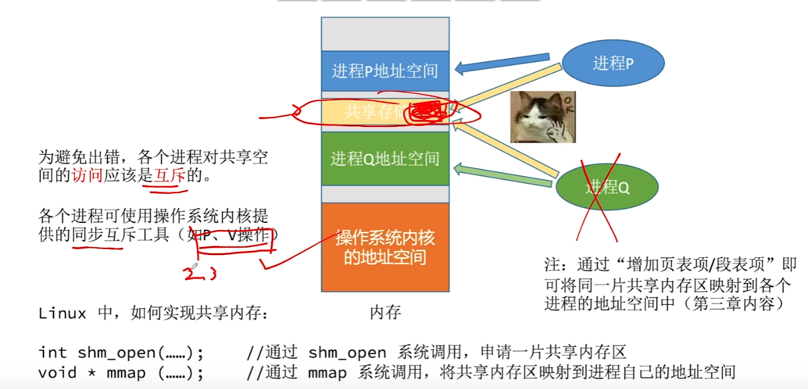
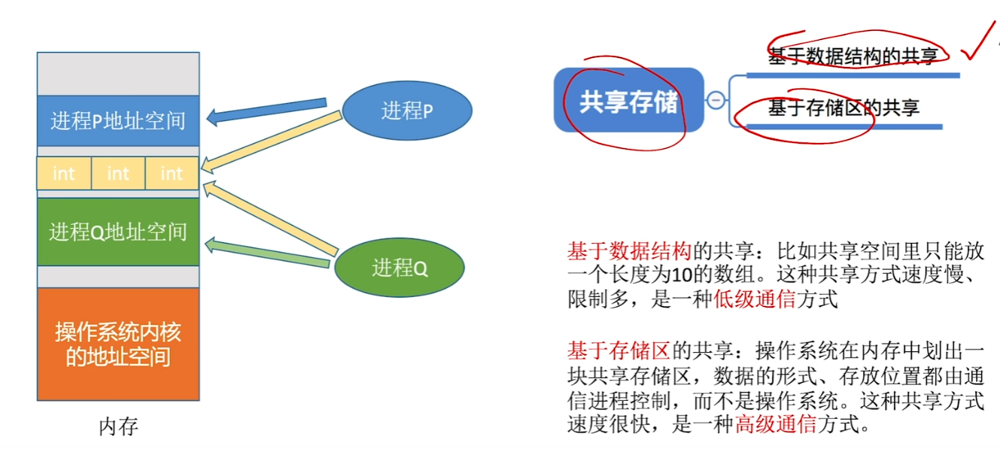
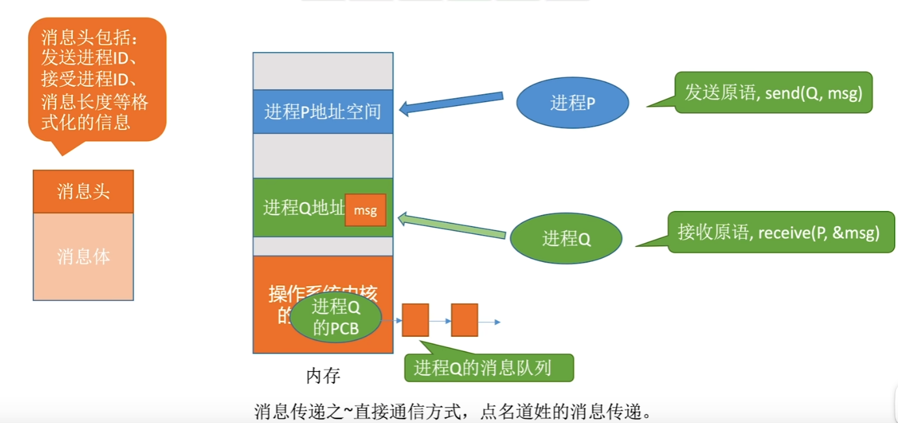
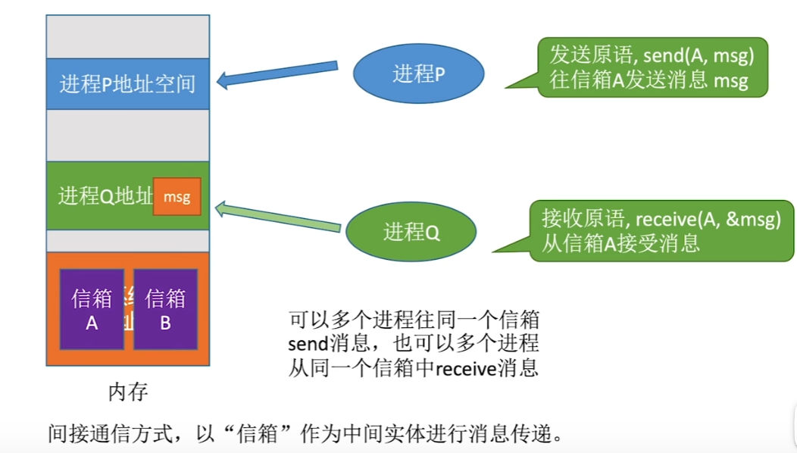
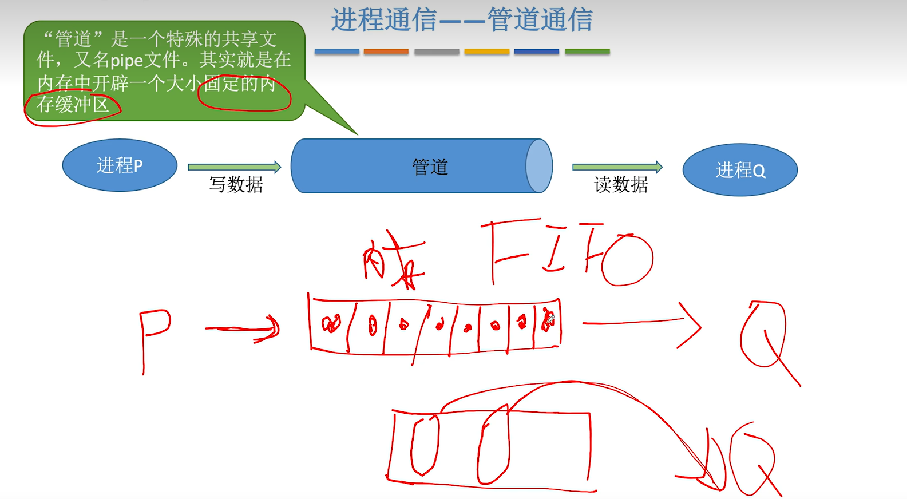
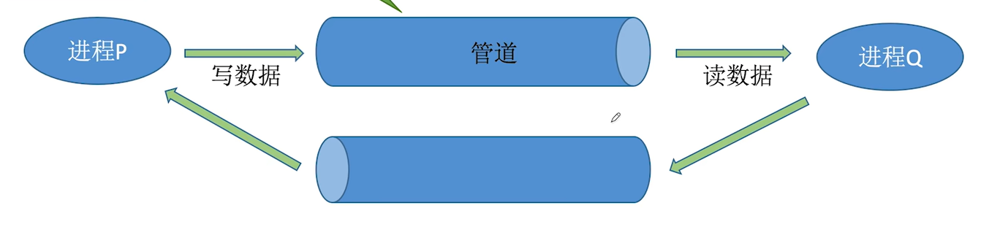

# 进程控制

> 需要用“原语”实现
>
> 原语用开中断与关中断实现
>
> - 如何实现原语的“原子性”

## 进程控制相关的原语

- 运行环境指系统中寄存器中的信息

# 进程通信

> 进程是分配系统资源的单位，因此各进程拥有的内存地址空间相互独立

## 1.共享存储

> 在通信的进程之间存在一块可直接访问的共享空间，通过对这片共享空间进行读/写操作实现进程间的消息交换
>
> 注意：在对共享空间进行读/写操作时，需要使用同步互斥工具进行控制

### 种类

- 低级方式：基于数据结构的共享
- 高级方式：基于存储区的共享

# 2.消息传递

> 进程间的数据交换以格式化的信息为单位，通过操作系统提供的“发送信息/接受信息”两个**原语**进行数据交换

### 种类

- 直接通信方式

- 间接通信方式（信箱通信）

# 3.管道通信

## 特点

- 管道通信只能采用**半双工通信**，如果要实现双向同时通信，则需要设置两个管道

- 各进程**互斥**的访问通道

- 当**管道写满**时，**写进程被阻塞**，直到读进程将管道中的数据取走，即可唤醒写进程
- 当**管道读空**时，**读进程被阻塞**，直到写进程往管道中写入数据，即可唤醒读进程

- **一个管道允许有多个写进程，一个读进程**