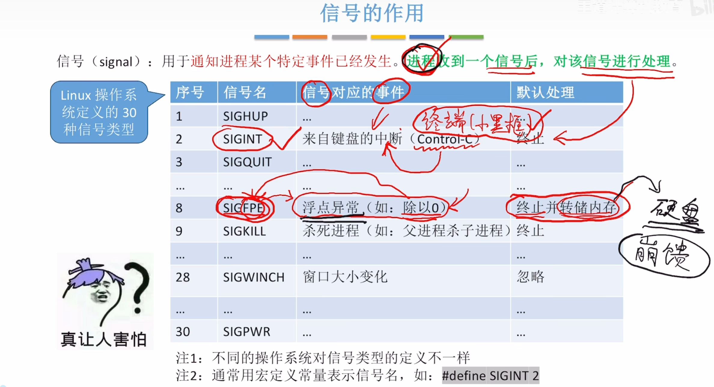
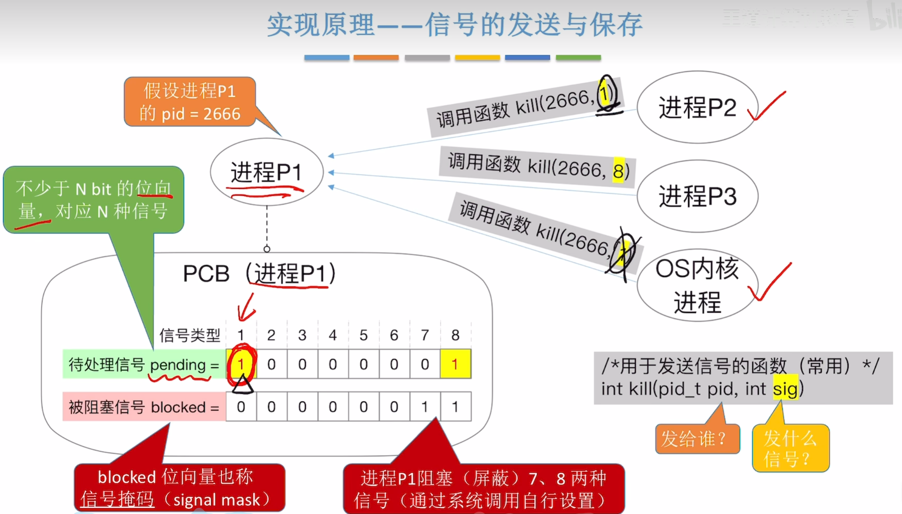
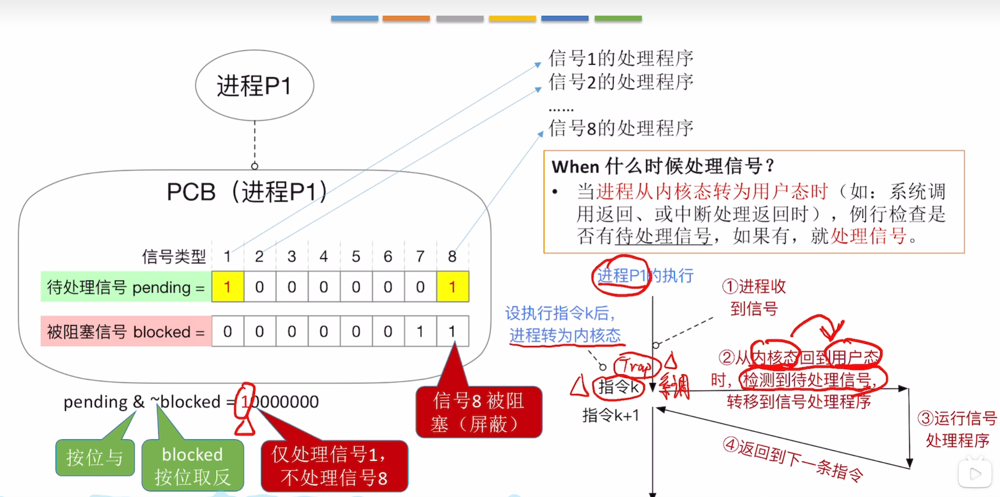
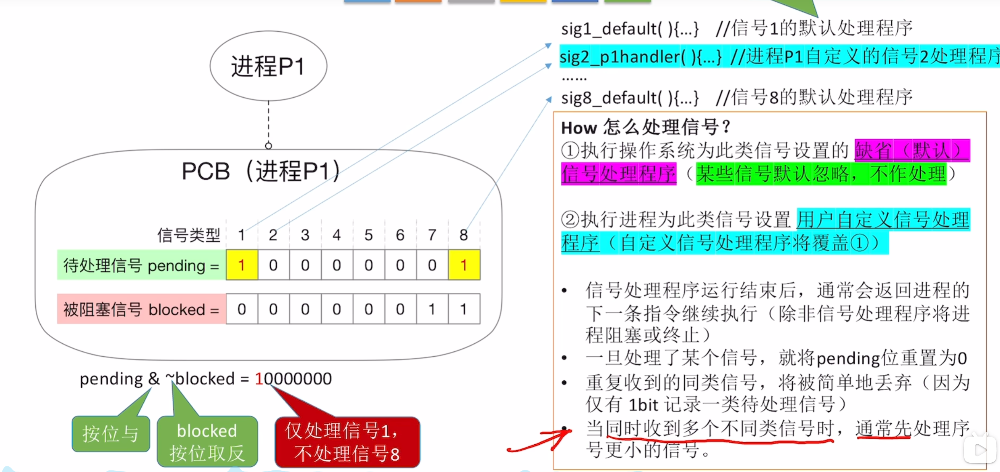
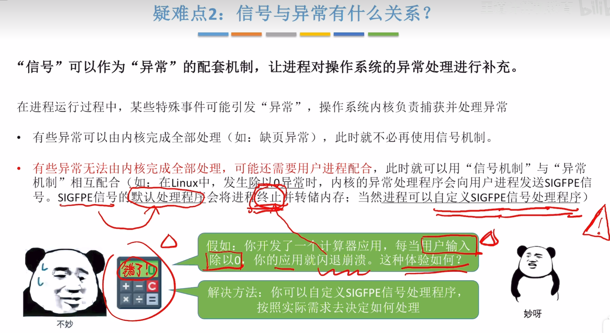

# 信号

> 信号的作用
>
> 用与通知某个特定事件已经发生

> 信号的发送与保存

- 注意：**无法识别**信号类型1是谁发送过来的（同一信号类型，后收到的会被丢弃）
- 进程直接允许发送的信号类型是**有限制的**

### 什么时候处理信号？

- 当进程从**内核态**转为**用户态**时，例行检查是否有待处理信号，如果有，就**处理信号**

> 信号处理的流程

> 信号处理的机制

- 每个进程的自定义程序**只作用于自身**，不对其他进程有效

> 信号与异常的关系

