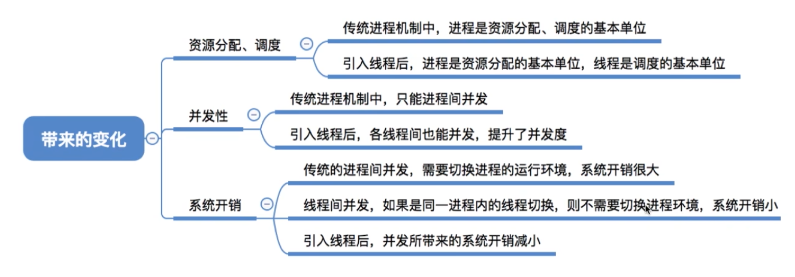

# 进程的概念与特点

## 基本概念

> 线程是**轻量级的进程**，是基本的CPU执行单元，也是**程序执行流的最小单位**，各线程之间可以**并发**

引入线程后的比较：

## 线程的属性

- 线程是处理机调度的单位
- 多CPU计算机中，各个线程可占用不同的CPU
- 每个线程都有一个线程ID、线程控制块（TCB）
- 线程也有就绪、阻塞、运行三种状态
- 线程几乎不拥有系统资源
- 同一进程的不同线程共享进程的资源
- 共享内存地址空间，同一进程中的线程间通信无需系统干预
- 同一进程的线程切换不会引起进程切换
- 不同进程的线程切换会引起进程切换
- 切换同进程中的线程，系统开销小
- 切换进程，系统开销大
