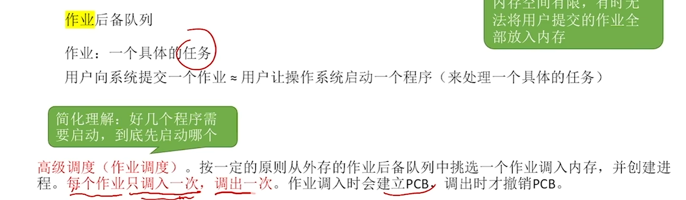
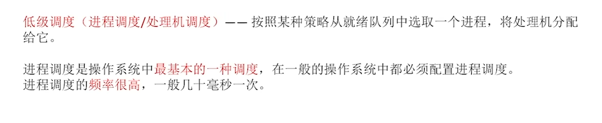
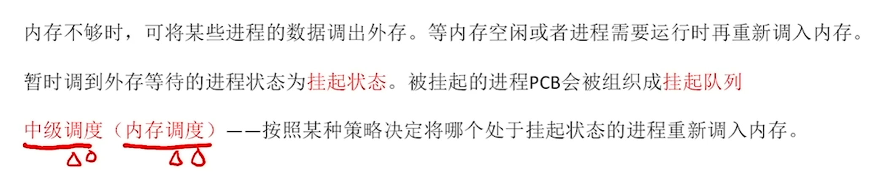
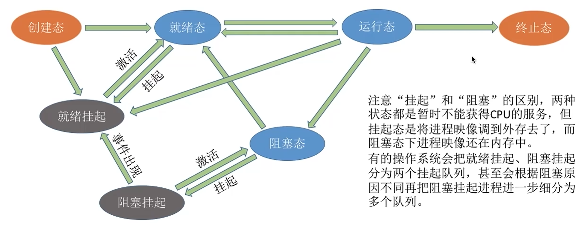
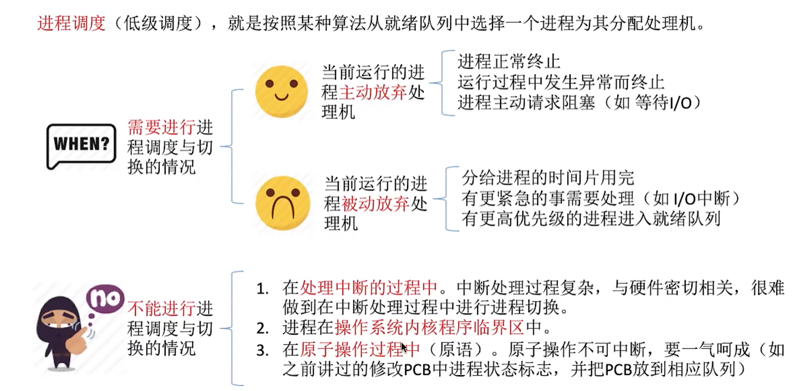
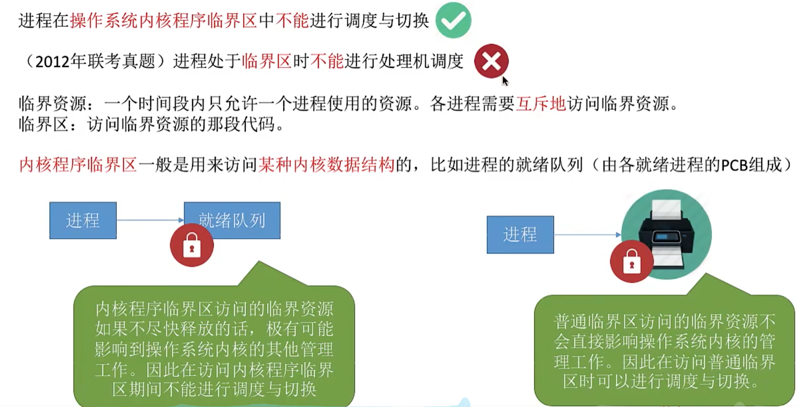
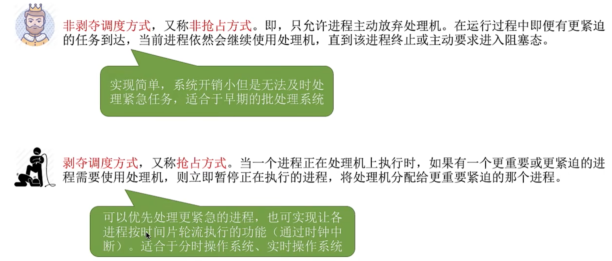
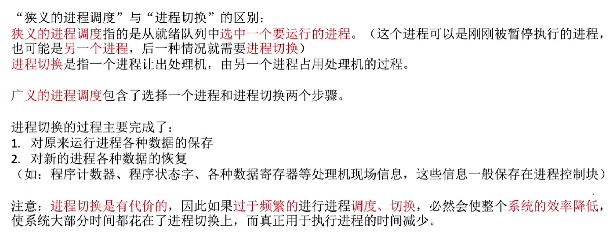
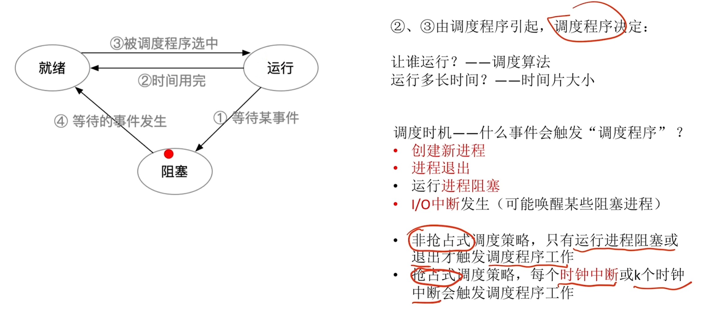
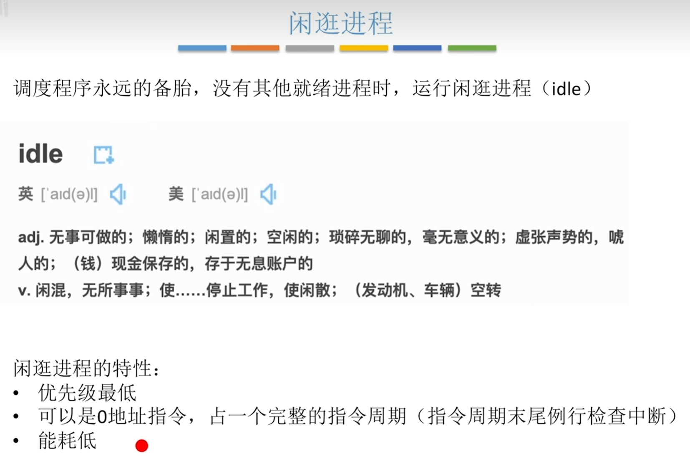

# 调度

## 概念

> CPU调度是对CPU进行分配，即从就绪队列中按照一定的算法选择一个进程将CPU分配给它运行

## 高级调度

## 低级调度

## 中级调度

- 补充：
- 就绪挂起：内存空间不够时，将处于就绪态的进程挂起到外存空间中（运行态和创建态也可能直接被就绪挂起）
- 阻塞挂起：内存空间不够时，将处于阻塞态的进程挂起到外存空间中

## 进程调度的时机

## 进程调度的方式

- 注意：

## 调度器/调度程序

闲逛进程（了解即可）

